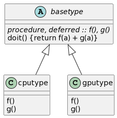

Modern Fortran implementation of a [template method
pattern](https://en.wikipedia.org/wiki/Template_method_pattern) with
two hardware backend specialisations (pure CPU and CPU/GPU backends).

Given an array of numbers $\mathbf{a} = \[a_1, ... a_n\]$, we want to compute

$$R = f(\mathbf{a}) + g(\mathbf{a})$$

with `f(a) = sum(a + 1)` and `g(a) = max(a * 2)`.

Given an input array `a`, the algorithm is

1. Compute `f(a)`
2. Compute `g(a)`
3. Compute `f(a) + g(a)`

This algorithm only depends on the interface of `f` and `g`: their
argument and what they return. Conversely, it _does not_ depend on the
actual implementation of `f` and `g`.

### Compiling and running the programs

```
cd backends_example
FC=nvfortran cmake -S . -B build
```

The above builds three executables:

1. `main_cpu`: CPU-only version.
2. `main_gpu`: Version with `f` and `g` implemented as accelerated GPU
kernels.
3. `main_hybrid`: Execution of GPU kernels is enabled/disabled at runtime.

From the build directory:

```
$ make main_hybrid # Build once, run everywhere.
./main_hybrid
$ Executing on CPU only
    184.000
$ ./main_hybrid --gpu
Executing CUDA kernels
    184.00
```

### Implementation



The algorithm itself is defined once as a bound procedure `doit` to the
abstract type `basetype` (`base.f90`).  This type is abstract because,
although `doit` is defined, `f` and `g` are not. This makes
instanciating a object of type basetype impossible.  The point is that
we can now _extend_ `basetype` with concrete types providing a
definition for both functions.

The `basetype` abstract type is extended by `cputype` (`cpu/cpu.f90`)
and `gputype` (`gpu/gpu.f90`).  The former implements `f` and `g`
using standard Fortran to be executed on a CPU. The latter, `gputype`,
provides an implementation of `f` and `g` based on CUDA Fortran, using
kernel procedures to be executed on NVIDIA GPUs.

The input array $\mathbf{a}$ is abstracted into a `memblock`
(`memblock.f90`) type (`mem`ory `block`).  The `cpublock`
(`cpu/cpublock.f90`) type holds an allocatable real array, whilst the
`gpublock` (`gpu/gpublock`) holds an allocatable real device array.

The current (main_hybrid.f90) implementation uses a pointer to the
right type depending on the execution target:

```f90
  case('gpu')
     gpublk = gpublock(16); blk => gpublk
```

An preferable approach would be to rely on automatic (re)allocation of
polymorphic entities

```f90
class(memblock), allocatable :: blk

case('gpu')
   blk = gpublock(16) ! Automatic allocation of the dynamic type
```

Unfortunately this is not supported by the NVIDIA Fortran compiler
(`nvfortran 22.5`).
